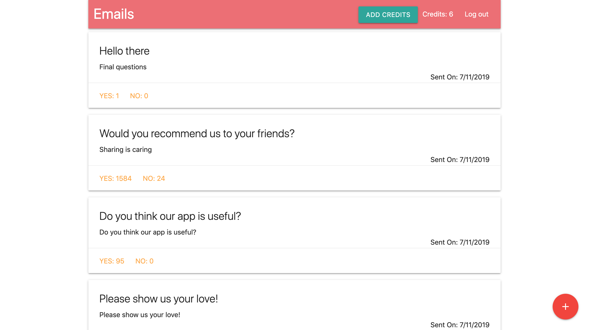

# Emails - Full-Stack application

One step forward in [learning path](https://www.udemy.com/node-with-react-fullstack-web-development) and one step closer to new projects!

## Main Goal

This repository is solely for learning purposes. Real projects will be in a stealth mode 👻

## Tech Stack

- Express/Node.js - backend server
- MongoDB with mongoose.js - NoSQL database
- Google OAuth with passportjs - authentication
- React & Redux - frontend
- Heroku & mLab - deployment

## Demo

### [Try it on heroku](https://emails-full-stack.herokuapp.com)


#### Screenshot



## Getting started

```
git clone https://github.com/jkhusanov/emails-full-stack

cd emails-full-stack

npm run everything

npm run dev
```

## Feedback

In case you have any feedback or questions, feel free to open a new issue on this repo or reach out to me [**@jkhusanov**](https://github.com/jkhusanov) on Github.
